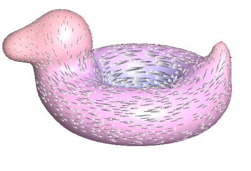
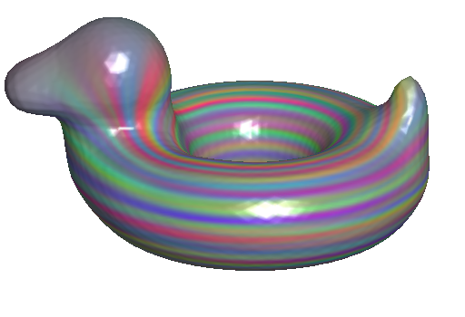

<h2>Line Integral Convolution on Surfaces (Version 1.00)</h2>

<TABLE>
<TR>
<TD>
<TD>
</TR>
</TABLE>

<a href="#LINKS">links</a>
<a href="#EXECUTABLE">executable</a>
<a href="#USAGE">usage</a>
<a href="#COMPILATION">compilation</a>
<a href="#CHANGES">changes</a>

This software supports line integral convolution on surfaces using anisotropic diffusion. 

<a name="LINKS"><b>LINKS</b></a> 
<ul>
<b>Papers:</b> 
<A HREF="https://www.cs.jhu.edu/~misha/MyPapers/SIG22a.pdf">[Bunge, Herholz, Sorkine-Hornung, Botsch, and Kazhdan, 2022]</A> 
<a href="http://www.cs.jhu.edu/~misha/MyPapers/SIG18.pdf">[Prada, Kazhdan, Chuang, and Hoppe, 2018]</a> 
<a href="https://ieeexplore.ieee.org/document/856995">[Diewald, Preusser, and Rumpf, 2000]</a>
 
<a href="https://dl.acm.org/doi/10.1145/166117.166151">[Cabral and Leedom, 1993]</a>
</UL>

<a name="EXECUTABLE"><b>EXECUTABLE</b></a> 
<UL>

<DL>

<b>LineIntegralConvolution</b>:
Generates per-vertex colors visualizing the streamlines of a vector field. The vector field is obtained by seeding the nodes with random colors, performing anistropic diffusion along the vector-field direction, and then performing gradient-domain sharpening to accentuate the stream-lines. 
Prior to computation, the mesh is rescaled to have unit-norm and default parameters are set to that scale.

<dt><b>--in</b> &lt;<i>input mesh</i>&gt;</dt>
<dd> This mandatory string specifies the name of the file from which the mesh will be read. 
The mesh is assumed to be represented in <A href="http://www.cc.gatech.edu/projects/large_models/ply.html">PLY</A> format, with the vector fields represented in one of two ways:
<UL>
<LI>As per-vertex quantities, encoded with the <CODE>vf_0</CODE>, <CODE>vf_1</CODE>, and <CODE>vf_2</CODE> property names -- corresponding to the <CODE>x</CODE>-, <CODE>y</CODE>-, and <CODE>z</CODE>-components of the vectors.
<LI>As per-face quantities, encoded with the <CODE>vf_0</CODE>, <CODE>vf_1</CODE>, and <CODE>vf_2</CODE> property names -- corresponding to the <CODE>x</CODE>-, <CODE>y</CODE>-, and <CODE>z</CODE>-components of the vectors.
</UL>
<dt>[<b>--out</b> &lt;<i>output mesh</i>&gt;]
<dd> This strings specifies the the name of the file to which the mesh will be written. 
The mesh is assumed to be represented in <A href="http://www.cc.gatech.edu/projects/large_models/ply.html">PLY</A> format, with colors encoded using the <CODE>red</CODE>, <CODE>green</CODE>, and <CODE>blue</CODE> property names.
<dt>[<b>--degree</b> &lt;<i>Lagrange interpolant degree</i>&gt;]
<dd> This integer specifies the the degree of the Lagrange interpolant used for performing the anisotropic diffusion 
While color values are output per-vertex, using a higher degree interpolant generates finer feature lines. 
Degrees <CODE>1</CODE>, <CODE>2</CODE>, and <CODE>3</CODE> are supported. 
The default value for this argument is <CODE>2</CODE>.
<dt>[<b>--dStep</b> &lt;<i>diffusion step-size</i>&gt;]
<dd> This floating point value specifies the the extent of the diffusion. (Smaller values result in visualizations with shorter stream-lines.) 
The default value for this argument is <CODE>10-5</CODE>.
<dt>[<b>--sScale</b> &lt;<i>gradient scaling term</i>&gt;]
<dd> This floating point value specifies the scale applied to the gradients when performing sharpening. (Larger values accentuate the stream-lines more.) 
The default value for this argument is <CODE>1024</CODE>.
<dt>[<b>--sWeight</b> &lt;<i>sharpening weight</i>&gt;]
<dd> This floating point value specifies the weight to be given to fitting the gradient term when performing sharpening. (Smaller values focus the sharpening on higher frequencies.) 
The default value for this argument is <CODE>10-5</CODE>.
<dt>[<b>--p</b> &lt;<i>p-norm</i>&gt;]
<dd> This integer specifies the <I>p</I>-norm used in estimating the scale of the vector field. (Larger values normalize using a value closer to the maximum vector length.) 
The default value for this argument is <CODE>8</CODE>.
<dt>[<b>--sub</b> &lt;<i>iterations of 1-to-4 planar subdivision</i>&gt;]
<dd> This integer specifies the number of iterations of planar 1-to-4 subdivision to be performed before generating the per-vertex colors. 
The default value for this argument is <CODE>0</CODE>.

</DL>

</UL>

<a name="USAGE"><b>USAGE EXAMPLES (WITH SAMPLE DATA)</b></a> 
For testing purposes, two vector fields on the <A "HREF="https://www.cs.cmu.edu/~kmcrane/Projects/ModelRepository/">Bob</A> model are provided -- <A HREF="Data/bob_isotropic.faces.ply">bob_isotropic.faces.ply</A> (with vectors stored at faces) and <A HREF="Data/bob_isotropic.vertices.ply">bob_isotropic.vertices.ply</A> (with vectors stored at vertices).

<UL>

<dl>

<b>LineIntegralConvolution</b>

To run this executable you specify the input mesh as well as the output:
<blockquote><code>% Bin/*/LineIntegralConvolution --in Data/bob_isotropic.vertices.ply --out lic.ply --sub 2</code></blockquote>
As the Bob model is low-resolution, we also specified that two passes of subdivision should be performed. 
If more pronounced stream-lines are desired, the gradient scaling term can be increased:
<blockquote><code>% Bin/*/LineIntegralConvolution --in Data/bob_isotropic.faces.ply --out lic.ply --sub 2 --sScale 2048</code></blockquote>

</dl>

</ul>

<a name="COMPILATION"><b>COMPILATION</b></a> 

<UL>
<LI>Compilation requires a linear solver. By default, we use the <CODE>LLt</CODE> implementation provided by  <A HREF="https://eigen.tuxfamily.org/">Eigen</A>. If you have <A HREF="https://www.intel.com/content/www/us/en/docs/oneapi/programming-guide/2024-1/intel-oneapi-math-kernel-library-onemkl.html">Intel's oneMKL</A>, we encourage you to use Eigen's <CODE>Pardiso</CODE> implementation. To to this you will need to enable the <CODE>USE_EIGEN_PARDISO</CODE> flag in <CODE>include/Src/PreProcessing.h</CODE>
</UL>

<a name="CHANGES"><b>HISTORY OF CHANGES</b></a> 

<!--
<a href="http://www.cs.jhu.edu/~misha/Code/TextureSignalProcessing/Version2.00/">Version 2.00</a>:
<ul>
<li> Added support for reaction-diffusion based on the Gray-Scott model.
</ul>
-->

